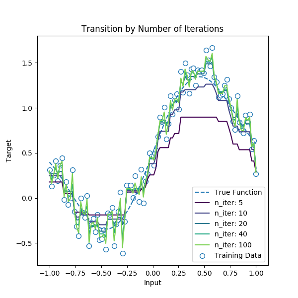

# Gradient Boosted Decision Tree

Gradient Boosted Decision Tree の python 実装です。
アルゴリズムのコアな部分は `numpy` のみを用いて実装されています。

## 参考文献

* [Introduction to Boosted Trees](http://xgboost.readthedocs.io/en/latest/model.html)
* [Gradient Boosted Tree (Xgboost) の取り扱い説明書](http://qiita.com/nykergoto/items/7922a8a3c1a7b622b935)
  * Gradient Boosting のアルゴリズムの詳細

## Table of Contents

* 必要なもの (Requirement)
* 使い方 (Usage)
* 実際の例 (Example)
  * MNISTの分類（binary_classification)
  * 人工データによる分類（二値分類、回帰問題）

## SetUp

### Requirements

サンプルの実行には以下のライブラリが必要です

```pip
numpy
scikit-learn
matplotlib
pandas
scipy
```

### Quick Start

### Run with Docker

事前にホストマシン上に docker 及び docker-compose がインストールされていることが条件です。

まず docker-compose を用いてイメージを build, その後コンテナを daemon で起動しておきます。

```bash
docker-compose build
docker-compose up -d
```

サンプルのコマンドはコンテナ内部で実行します

```bash
# コンテナの内部に潜り込む
docker exec -it gbdt-app bash

# sample.py を実行
python sample.py
```

## Run on local

venv を使うのがいいかなと思います。

```bash
python3 -m venv .venv
source ./.venv/bin/activate

pip install -U pip && pip install -r requirements.txt
```


## 使い方

`git clone` もしくはdownloadしたフォルダを実行ファイルと同じ階層に置きます

```python
import gbdtree as gb

clf = gb.GradientBoostedDT()
x_train,t_train = ~~ # 適当なトレーニングデータ
clf.fit(x=x_train, t=t_train)
```

## 実行例

`mnist.py` と `sample.py` の2つのファイルが実行サンプルになっています。

### mnist.py

MNIST の手書きデータを用いた分類問題をときます。

* training data
  * `MNIST Original`の手書き文字データ
  * 出力は `{0, 1, 2,..., 9}` の１０クラス分類問題
  * そのままだと時間がかかりすぎるので、二値分類（３と８の分類）で `datasize=2000` になおして実行

* Gradient Boosted Tree のparameters
  * 目的関数：交差エントロピー
  * 活性化関数：ロジスティクスシグモイド関数

> Note:  
> `mnist.py` ではMNISTの手書きデータ・セットをネット上から取得するので、ローカルにデータを持っていない場合にかなり時間がかかる場合があります。また学習時間もパラメータをデフォルトのままで行うと30分ぐらいかかります。計算を投げてご飯でも食べに行きましょう。

実行結果は以下のようになります

```console
2016-06-23 01:20:01,501	__main__	This is MNIST Original dataset
2016-06-23 01:20:01,502	__main__	target: 3,8
2016-06-23 01:20:01,803	__main__	training datasize: 2000
2016-06-23 01:20:01,803	__main__	test datasize: 11966
2016-06-23 01:52:45,349	__main__	accuracy:0.9745946849406653
```

分類精度97.5%を達成(でもめっちゃ時間かかる...)

* feature_importance
* 学習時の logging

が `/examples/mnist` に出力されます.

#### Output Log Sample

```text
start build new Tree
build new node depth=0_N=2000 gain=538.7344
build new node depth=1_N=1000 gain=96.3745
build new node depth=1_N=1000 gain=45.4259
build new node depth=2_N=163 gain=40.5793
build new node depth=2_N=855 gain=22.9140
build new node depth=2_N=145 gain=21.3546
build new node depth=2_N=837 gain=19.1825
build new node depth=3_N=117 gain=19.0716
build new node depth=3_N=82 gain=15.8894
build new node depth=3_N=824 gain=12.5804
build new node depth=3_N=26 gain=9.2701
build new node depth=4_N=815 gain=7.2187
build new node depth=4_N=28 gain=6.4043
build new node depth=3_N=81 gain=5.9525
build new node depth=4_N=12 gain=5.7942
==============================
end tree iteration
iterate:0	loss:4.14e-01
valid loss:	4.308e-01
start build new Tree
build new node depth=0_N=2000 gain=235.5829
build new node depth=1_N=1000 gain=43.7688
build new node depth=1_N=1000 gain=24.4370
build new node depth=2_N=235 gain=27.6230
build new node depth=3_N=117 gain=15.4541
build new node depth=2_N=166 gain=14.8643
build new node depth=2_N=765 gain=9.7750
build new node depth=2_N=834 gain=9.3208
build new node depth=3_N=132 gain=8.3144
build new node depth=4_N=39 gain=9.1458
build new node depth=3_N=33 gain=7.9907
build new node depth=3_N=118 gain=6.5067
build new node depth=4_N=93 gain=6.0008
build new node depth=3_N=732 gain=5.9684
build new node depth=3_N=40 gain=5.7522
==============================
end tree iteration
iterate:1	loss:2.74e-01
(improve: 1.401e-01)
valid loss:	2.992e-01
start build new Tree
```

### sample.py

実行方法は単に python スクリプトとして実行すればOKです。引数等はありません。

```bash
python sample.py
```

実行すると以下の2つの問題を解きます

* 人工的に作成した二次元入力に対する二値分類問題
* 人工的に作成した一次元入力に対する実数値の回帰問題

#### 二値分類問題

* training data:
  * 各クラスを、[1,1] [-1.,-1] を中心としたガウス分布からのサンプリングから作成します
  * 図中で青と緑で表示されています.
* モデルパラメータ
  * 目的関数: 交差エントロピー
  * 活性化関数.: シグモイド関数

#### 結果


#### 連続変数に対する回帰問題

一次元のランダムな入力に対して、正解関数 + ノイズを付与した正解ラベルを作成し、それを予測するようなモデルを作成します。この時複数の boosting 回数でモデルを作成し、回数が多くなると予測値がよりデータに引っ張られていく様子を可視化します.

boosting の回数は `n_iter` で制御されている為これを変化させて学習機をそれぞれの `n_iter` で作成し, 予測値をグラフにプロットしています.

* training data
  * 以下で定義される関数値にガウスノイズを加えたもの

```python
def test_function(x):
    return 1 / (1. + np.exp(-4 * x)) + .5 * np.sin(4 * x)
```

* モデルパラメータ
  * 目的関数： 二乗ロス関数
  * 活性化関数: 恒等写像
  * `max_depth=8`（毎回最大でどのぐらいの深さまで木を作るか）
  * `gamma=.01`（木が成長できる最小の `gain` を規定するパラメータ)
  * `lam=.1`

> 結果



`gamma` や `max_depth` を変えたり, valid_data を作って, train/valid loss を可視化してみるのも面白いかも知れません。
