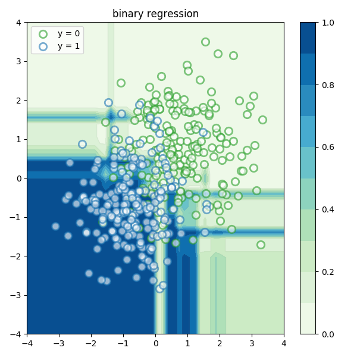

# Gradient Boosted Decision Tree

Gradient Boosted Decision Tree の python 実装です。
アルゴリズムのコアな部分は `numpy` のみを用いて実装されています。

## 参考文献

* [Introduction to Boosted Trees](http://xgboost.readthedocs.io/en/latest/model.html)
* [Gradient Boosted Tree (Xgboost) の取り扱い説明書](http://qiita.com/nykergoto/items/7922a8a3c1a7b622b935)
  * Gradient Boosting のアルゴリズムの詳細

## Table of Contents

* 必要なもの (Requirement)
* 使い方 (Usage)
* 実際の例 (Example)
  * MNISTの分類（binary_classification)
  * 人工データによる分類（二値分類、回帰問題）

## 必要なもの

### Coreライブラリ

* matplotlib
* numpy
* scikit-learn

### サンプルを動かすのに必要なもの

* pandas(dataframeにしてcsvを作るため)
* seaborn(各種グラフ表示のため)

## 使い方

`git clone` もしくはdownloadしたフォルダを実行ファイルと同じ階層に置きます

```python
import gbdtree as gb

clf = gb.GradientBoostedDT()
x_train,t_train = ~~ # 適当なトレーニングデータ
clf.fit(x=x_train, t=t_train)
```

## 実行例

`mnist.py` と `sample.py` の2つのファイルが実行サンプルになっています。

## sample.py

人工的に作成したデータセットを用いて二値分類と回帰問題を実行するコードです。

### 二値分類問題

* training data:
  * 各クラスを、[1,1] [-1.,-1] を中心としたガウス分布からのサンプリングから作成します
  * 図中で青と緑で表示されています.
* モデルパラメータ
  * 目的関数: 交差エントロピー
  * 活性化関数.: シグモイド関数

#### 結果



### 連続変数に対する回帰問題

ターゲットが連続変数の場合についても同様に人工的にデータを作成して回帰問題を解いてみます。
その時, boosting の回数によって予測値がよりデータに引っ張られていく様子を可視化します.

boosting の回数は `n_iter` で制御されている為これを変化させて学習機をそれぞれの `n_iter` で作成し, 予測値をグラフにプロットしています.

* training data
    * 以下で定義される関数値にガウスノイズを加えたもの

```python
def test_function(x):
    return 1 / (1. + np.exp(-4 * x)) + .5 * np.sin(4 * x)
```

* モデルパラメータ
  * 目的関数： 二乗ロス関数
  * 活性化関数: 恒等写像
  * `max_depth=8`（毎回最大でどのぐらいの深さまで木を作るか）
  * `gamma=.01`（木が成長できる最小の `gain` を規定するパラメータ)
  * `lam=.1`

### 結果


`gamma` や `max_depth` を変えたり, valid_data を作って, train/valid loss を可視化してみるのも面白いかも知れません。

### mnist.py

MNIST の手書きデータを用いた分類問題をときます。

* training data
  * `MNIST Original`の手書き文字データ
  * 出力は `{0, 1, 2,..., 9}` の１０クラス分類問題
  * そのままだと時間がかかりすぎるので、二値分類（３と８の分類）で `datasize=2000` になおして実行

* Gradient Boosted Tree のparameters
  * 目的関数：交差エントロピー
  * 活性化関数：ロジスティクスシグモイド関数

> Note:  
> `mnist.py` ではMNISTの手書きデータ・セットをネット上から取得するので、ローカルにデータを持っていない場合にかなり時間がかかる場合があります。また学習時間もパラメータをデフォルトのままで行うと30分ぐらいかかります。計算を投げてご飯でも食べに行きましょう。

#### 結果

```
2016-06-23 01:20:01,501	__main__	This is MNIST Original dataset
2016-06-23 01:20:01,502	__main__	target: 3,8
2016-06-23 01:20:01,803	__main__	training datasize: 2000
2016-06-23 01:20:01,803	__main__	test datasize: 11966
2016-06-23 01:52:45,349	__main__	accuracy:0.9745946849406653
```

分類精度97.5%を達成(でもめっちゃ時間かかる...)
